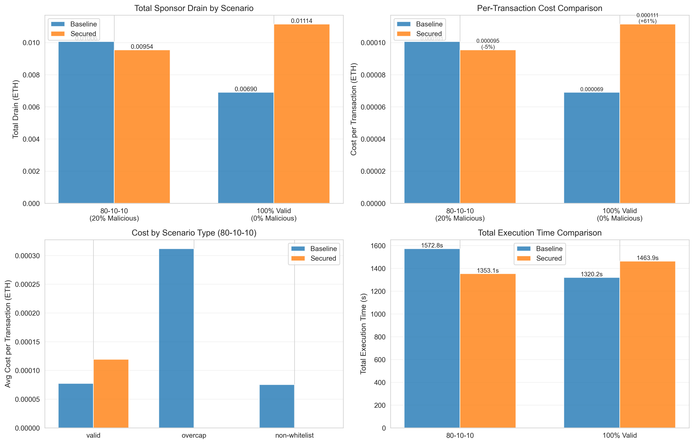

# ERC-4337 Paymasters: Baseline vs. Secured

Designs, deploys, and empirically evaluates two ERC-4337 paymaster implementations on Ethereum Sepolia — a permissive **BaselinePaymaster** and a hardened **SecuredPaymaster** — to measure the cost and performance tradeoffs of paymaster security controls under realistic attack traffic.

📄 [Full report, paper, and presentation → /Document](./Documents/)

---

## What It Does

ERC-4337 paymasters sponsor gas fees on behalf of users. A poorly secured paymaster can be drained by attackers submitting malicious UserOperations with inflated gas limits, non-whitelisted targets, or quota exhaustion.

This project deploys both paymasters — the baseline approves everything, the secured one enforces gas caps, contract whitelisting, per-user/dapp daily quotas, cryptographic sponsorship signatures, and replay protection. Two 100-operation attack scenarios are run against each on Sepolia, on-chain costs are collected from `UserOperationEvent.actualGasCost`, and the results are analyzed to find the break-even malicious traffic threshold.

---

## Project Structure

```
contracts/          Solidity — BaselinePaymaster, SecuredPaymaster, BaselineAccount, MockTarget
scripts/            Hardhat deployment + experiment runner scripts
backend/            Node.js/Express analytics server
frontend/           React + Vite live metrics dashboard
results/            CSVs, Python analysis script, output charts
Document/           Final paper (.docx/.pdf) and presentations (.pptx)
deployments.json    Deployed Sepolia contract addresses
```

---

## Setup

Node.js ≥ 18 required. Create a `.env` in the project root:

```properties
SEPOLIA_RPC_URL=https://eth-sepolia.g.alchemy.com/v2/YOUR_ALCHEMY_KEY
DEPLOYER_PRIVATE_KEY=0xYOUR_PRIVATE_KEY
ENTRYPOINT_ADDRESS=0x5FF137D4b0FDCD49DcA30c7CF57E578a026d2789
```

Then install dependencies:

```bash
npm install
npm run dashboard:install
```

---

## Running the Project

### 1. Deploy Contracts

The repo includes pre-deployed contracts on Sepolia (`deployments.json`). Only re-deploy if the Solidity source was changed.

```bash
npm run compile

npm run deploy:entrypoint:sepolia
npm run deploy:baseline:sepolia
npm run deploy:account:sepolia
npm run deploy:secured:sepolia
npm run deploy:mocktarget:sepolia
npm run whitelist:mocktarget:sepolia
```

After deploying, update the addresses in `deployments.json` and the experiment scripts.

### 2. Fund the Paymasters

Each paymaster needs an ETH deposit at the EntryPoint before running scenarios:

```bash
npx hardhat run scripts/entryPointPrefund.ts --network sepolia
```

### 3. Run Scenarios

**80% valid / 10% overcap / 10% non-whitelist:**

```bash
npx hardhat run scripts/runScenarioMatrix_80_10_10.ts --network sepolia
```

**100% valid traffic:**

```bash
npx hardhat run scripts/runScenarioMatrix_100.ts --network sepolia
```

Both scripts run against Baseline and Secured sequentially and write results to `backend/data/`.

### 4. Single UserOp Verification

```bash
npm run send:userop:sepolia
npm run send:userop:secured:sepolia
npm run send:userop:secured:whitelist:allowed:sepolia
npm run send:userop:secured:whitelist:rejected:sepolia
```

### 5. Dashboard

```bash
npm run dashboard:backend    # Terminal 1
npm run dashboard:frontend   # Terminal 2
```

---

## Deployed Contracts (Sepolia)

| Contract | Address |
|---|---|
| EntryPoint | `0xc388b22Cc99Db398e6F04a5a39e879dcC6333c5d` |
| BaselinePaymaster | `0xF011e6134eC20eA4Da73e8272C14dfF00Ef61188` |
| SecuredPaymaster | `0x867e56382b806DEB838e4C65a0d64C9597301185` |
| BaselineAccount | `0xD4923772777916bf3867BDC6095c13bE64Be8E48` |
| MockTarget | `0x97a9b16839d578e33F392654Ba4cF94b944d4E04` |

---

## Results

100 UserOperations per scenario, both paymasters pre-funded with 0.05 ETH.

### Scenario A — 80-10-10 (20% malicious traffic)

| Metric | Baseline | Secured | Delta |
|---|---|---|---|
| Total Sponsor Drain | 0.010056 ETH | 0.009541 ETH | −5.1% |
| Avg Cost per Op | 0.000101 ETH | 0.000095 ETH | −5.9% |
| Total Execution Time | 1572.8 s | 1353.1 s | −14.0% |
| Avg Latency per Op | 15.73 ms | 13.53 ms | −14.0% |
| Success Rate | 100% | 80% | attacks rejected |

The Secured Paymaster incurs zero cost on all 20 malicious operations — they are rejected at validation before hitting the mempool. The 14% speed gain comes from fail-fast rejection.

### Scenario B — 100% Valid Traffic

| Metric | Baseline | Secured | Delta |
|---|---|---|---|
| Total Sponsor Drain | 0.006905 ETH | 0.011144 ETH | +61.4% |
| Avg Cost per Op | 0.000069 ETH | 0.000111 ETH | +60.9% |
| Total Execution Time | 1320.2 s | 1463.9 s | +10.9% |
| Success Rate | 100% | 100% | — |

With no attack traffic, the Secured Paymaster's validation overhead adds ~0.000042 ETH per op and ~10.9% latency with nothing to offset it.

### Break-Even

```
breakeven = 0.000042 / (0.000193 + 0.000042) = 17.87%
```

Above ~18% malicious traffic the Secured Paymaster is cheaper and faster. At 100k transactions/month with 20% attack traffic, that projects to ~0.8 ETH/month in savings.

### Charts




